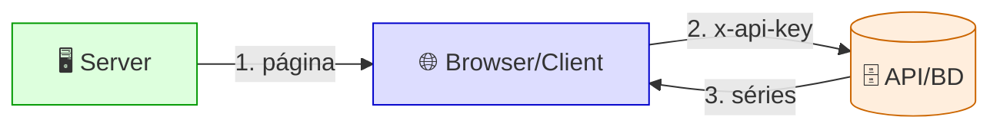
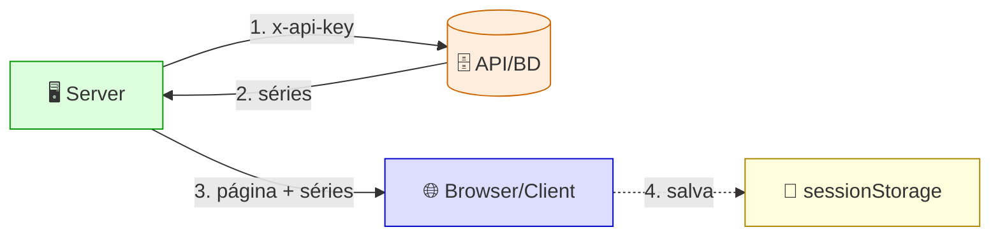
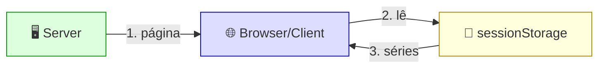
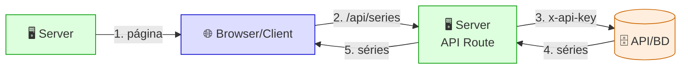
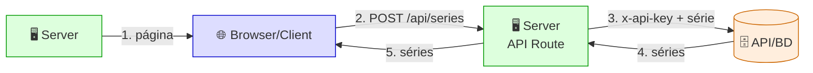

# CRUD Front — Next.js 16 (App Router)

## 🟣 arrays de Exemplos

### 🔑 Get - ApiKey → `/apikey`

❌ **api-key exposta** — o browser vai direto na API, sem voltar ao server (DevTools → Network → Headers → `x-api-key`)

---

### 🖥️ Get - SSR → `/ssr`

✅ **api-key privada** · 💾 **dados salvos no browser** — DevTools → Application → Session Storage

> 💡 O passo 4 (**é adicional**): salvar no sessionStorage serve apenas para o card **Get - Offline** funcionar sem API.

---

### 📴 Get - Offline → `/offline`

✅ **sem chamar a API** — DevTools → Network vazio

> 💡 Lê os dados que o **Get - SSR** salvou (passo 4 tracejado). Visite o `/ssr` antes.

---

### 🔗 Get - FullStack → `/fullstack`

✅ **api-key privada** — o browser volta ao server (route.js), que vai na API (DevTools → Network → só `/api/series`, sem `x-api-key`)

---

## 🧩 arrays de CRUD

### ➕ Post - Create → `/create`

✅ **api-key privada** — o formulário vai para o route.js, que cria na API (DevTools → Network → `series` → Payload, sem `x-api-key`)